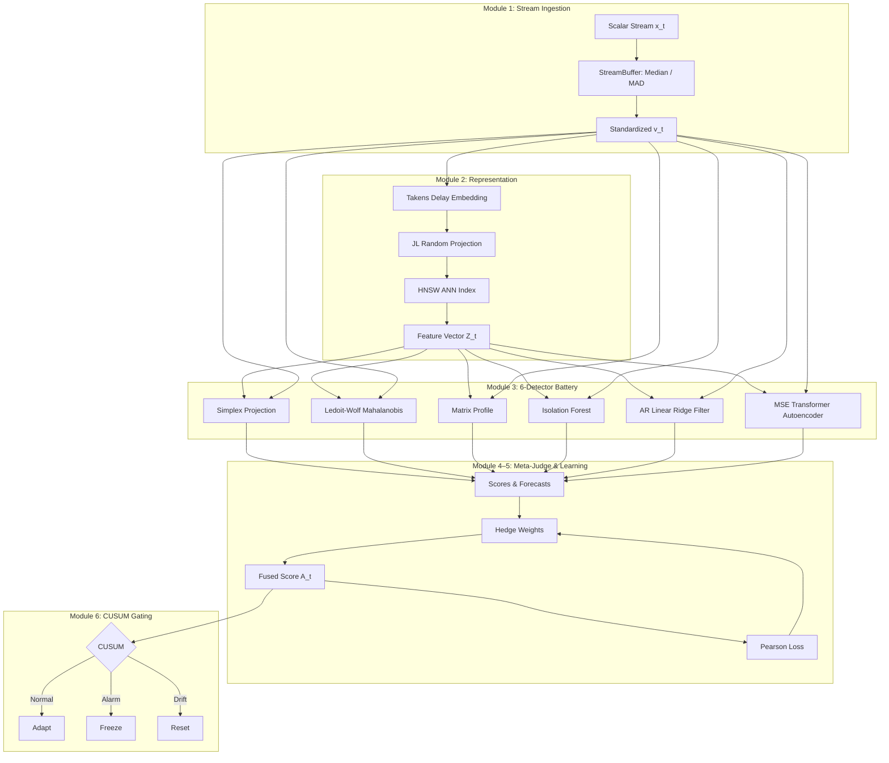

# open-phase-ensemble

[](https://github.com/mohamedhossammohamed/open-phase-ensemble/actions/workflows/tests.yml)
[](https://mohamedhossammohamed.github.io/open-phase-ensemble/)
[](https://opensource.org/licenses/Apache-2.0)
[](https://www.python.org/)

**open-phase-ensemble** is an open-source, non-parametric, multi-tool ensemble system for streaming time-series anomaly detection and forecasting. It combines six orthogonal detection paradigms — Empirical Dynamic Modeling, Ledoit-Wolf Mahalanobis distance, STOMP Matrix Profile, Isolation Forest, AR Linear Ridge Filter, and MSE Transformer Autoencoder — under an online Hedge multiplicative-weights Meta-Judge with CUSUM change gating, strictly enforcing zero-lookahead stream processing and deterministic execution.

---

> [!CAUTION]
> **Experimental Research — Pending Independent Review**
>
> This project is experimental and provided for research and educational purposes only. All performance claims are preliminary, self-reported, and have not been independently validated or peer-reviewed. Do not use this system for safety-critical, medical, financial, or production decisions without independent expert review.

---

## System Architecture



---

## Quickstart

```bash
git clone https://github.com/mohamedhossammohamed/open-phase-ensemble.git
cd open-phase-ensemble
python3 -m venv .venv && source .venv/bin/activate
pip install -e .
```

```python
from tsad.pipeline import TSADPipeline

pipeline = TSADPipeline(tau=2, d=8)

for x in [0.1, 0.2, 0.15, 0.18, 8.5, 0.12]:
    A_t, v_hat = pipeline.step(x)
    print(f"x={x:5.2f}  A_t={A_t:.4f}  forecast={v_hat:.4f}")
```

```bash
# Full test suite (34/34 passing)
PYTHONPATH=src pytest tests/ -v

# Benchmark evaluation
PYTHONPATH=src python scripts/run_benchmark.py
```

---

## Preliminary Benchmark Results

> **All numbers are preliminary, self-reported, and pending independent external review.**
> IAAFT surrogate scores are stochastic and vary across runs; system VUS-ROC scores are deterministic.

| Dataset | $N$ | System VUS-ROC | System VUS-PR | IAAFT Null VUS-ROC | Edge ($\Delta$) | Status |
| :--- | :---: | :---: | :---: | :---: | :---: | :--- |
| PhysioNet MIT-BIH (record 100) | 5,143 | **0.8592** | 0.6926 | ~0.49 | ~+0.37 | Preliminary |
| CWRU Bearing | 5,000 | **0.9711** | 0.7111 | ~0.61 | ~+0.37 | Preliminary |

VUS-ROC is computed using standard label-only range buffering (Paparrizos et al., 2022). Predicted scores are never buffered.

---

## Known Limitations

1. **Metric Correction Applied**: An internal audit identified that an earlier version of `vus.py` applied temporal range buffering to both labels and predicted scores, inflating reported numbers. This has been corrected — buffering is now applied strictly to ground-truth labels. All numbers above reflect the corrected evaluation.

2. **Detector Naming Alignment**: Two detectors were renamed to reflect their actual implementations:
   - **ARFilterDetector**: Online AR($p$) linear ridge regression filter (not full SARIMA).
   - **MSETransformerAutoencoder**: Standard MSE reconstruction (not association discrepancy).

3. **Reference Comparison Not Valid**: Direct numerical comparison to external closed-source references (e.g., `phase_space_matcher` at 83.96–86.02%) is scientifically invalid due to metric type mismatch (VUS-ROC vs. PA-F1), evaluation length differences, and inability to verify the reference evaluation protocol. We report our own VUS-ROC numbers independently without claiming superiority.

4. **Single-Run Point Estimates**: Results are from single deterministic runs. No confidence intervals are provided.

---

## Future Work

- Multi-seed evaluations to generate 95% confidence intervals are planned for a future release to further validate the preliminary point estimates.
- Standardized cross-system benchmark protocol for fair comparison with external references.
- Expansion of the detector battery beyond 6 experts.

---

## Documentation

Full documentation: **[mohamedhossammohamed.github.io/open-phase-ensemble](https://mohamedhossammohamed.github.io/open-phase-ensemble/)**

---

## License & Citation

Licensed under [Apache License 2.0](LICENSE).

```bibtex
@software{open_phase_ensemble2026,
  title  = {open-phase-ensemble: Non-Parametric Multi-Tool Ensemble for Time-Series Anomaly Detection},
  author = {open-phase-ensemble Contributors},
  year   = {2026},
  url    = {https://github.com/mohamedhossammohamed/open-phase-ensemble}
}
```
