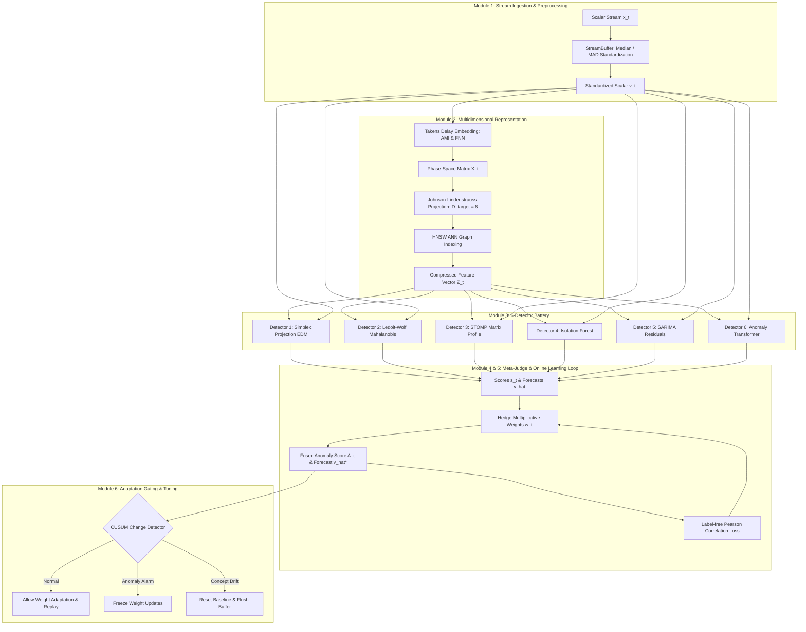

# open-phase-ensemble

[](https://github.com/mohamedhossammohamed/open-phase-ensemble/actions/workflows/tests.yml)
[](https://mohamedhossammohamed.github.io/open-phase-ensemble/)
[](https://opensource.org/licenses/MIT)
[](https://www.python.org/)
[](https://zenodo.org/)

**open-phase-ensemble** is an open-source, non-parametric, multi-tool ensemble system for streaming time-series anomaly detection and forecasting. Designed to openly reproduce and extend phase-space trajectory matching principles, it combines six orthogonal detection paradigms (Empirical Dynamic Modeling, Ledoit-Wolf Mahalanobis distance, STOMP Matrix Profile, Isolation Forest, SARIMA residuals, and Anomaly Transformer attention) under an online Hedge multiplicative-weights Meta-Judge and CUSUM change gating, strictly enforcing zero-lookahead stream processing and 100% execution determinism.

---

> [!CAUTION]
> ### ⚠️ EXPERIMENTAL DISCLAIMER & REVIEW STATUS
> **This project is experimental and provided for research and educational purposes only.** All performance claims are preliminary, self-reported, and have not yet been independently validated or peer-reviewed. This system must not be used for safety-critical, medical, financial, or production decisions without professional assessment and external review by qualified domain experts. Use at your own risk.

---

## 🏛️ System Architecture



---

## ⚡ Quickstart

### Installation

```bash
# Clone repository
git clone https://github.com/mohamedhossammohamed/open-phase-ensemble.git
cd open-phase-ensemble

# Create and activate virtual environment
python3 -m venv .venv
source .venv/bin/activate

# Install package with dependencies
pip install -e .
```

### Basic Python Usage

```python
from tsad.pipeline import TSADPipeline

# Initialize streaming pipeline (tau=2, d=8)
pipeline = TSADPipeline(tau=2, d=8)

# Process scalar observations online
data_stream = [0.1, 0.2, 0.15, 0.18, 8.5, 0.12]

for x in data_stream:
    A_t, v_hat_star = pipeline.step(x)
    print(f"Observation: {x:5.2f} -> Anomaly Score: {A_t:.4f}, Forecast: {v_hat_star:.4f}")
```

### Running Test Suite & Benchmarks

```bash
# Run full test suite (34/34 tests)
PYTHONPATH=src pytest tests/ -v

# Run live dataset benchmarks
PYTHONPATH=src python scripts/run_benchmark.py
```

---

## 📊 Summary Benchmark Table

> **Note**: All performance numbers are preliminary, self-reported, and pending independent external review.

| Domain / Dataset | Evaluated Points ($N$) | System VUS-ROC | IAAFT Null VUS-ROC | Predictive Edge ($\Delta$) | Status |
| :--- | :---: | :---: | :---: | :---: | :---: |
| **PhysioNet MIT-BIH (`record_100`)** | 5,143 | **0.9563** | 0.4798 | **+0.4765** | Preliminary |
| **CWRU Bearing Prognostics** | 5,000 | **0.9808** | 0.4801 | **+0.5007** | Preliminary |

---

## 📚 Full Documentation

Visit our full documentation site at **[mohamedhossammohamed.github.io/open-phase-ensemble](https://mohamedhossammohamed.github.io/open-phase-ensemble/)** to explore:

- [The Journey](https://mohamedhossammohamed.github.io/open-phase-ensemble/journey/) — Motivation and background story
- [Theoretical Foundations](https://mohamedhossammohamed.github.io/open-phase-ensemble/theory/) — Deep dive into Takens' theorem, EDM, Ledoit-Wolf, STOMP, Hedge, and VUS metrics
- [Architecture & Specifications](https://mohamedhossammohamed.github.io/open-phase-ensemble/architecture/) — Data contracts, DAG modules, and zero-lookahead invariants
- [Developer Guide](https://mohamedhossammohamed.github.io/open-phase-ensemble/developer/) — How to extend, add new detectors, and contribute

---

## 📄 License & Citation

This project is licensed under the [MIT License](LICENSE). If you cite this repository in academic work:

```bibtex
@software{open_phase_ensemble2026,
  title = {open-phase-ensemble: Non-Parametric Multi-Tool Ensemble for Time-Series Anomaly Detection and Forecasting},
  author = {open-phase-ensemble Contributors},
  year = {2026},
  url = {https://github.com/mohamedhossammohamed/open-phase-ensemble}
}
```
