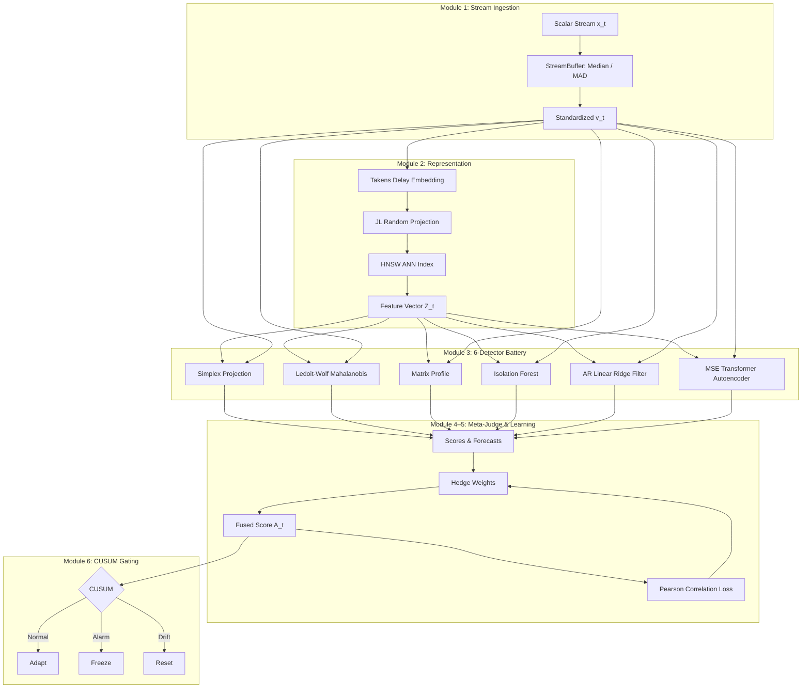

# open-phase-ensemble

[](https://github.com/mohamedhossammohamed/open-phase-ensemble/actions/workflows/tests.yml)
[](https://mohamedhossammohamed.github.io/open-phase-ensemble/)
[](https://opensource.org/licenses/Apache-2.0)
[](https://www.python.org/)

**open-phase-ensemble** is an open-source, heterogeneous multi-tool ensemble system for streaming time-series anomaly detection and forecasting. It combines six detection paradigms — Empirical Dynamic Modeling (Simplex Projection), Ledoit-Wolf Mahalanobis distance, single-window Matrix Profile, Isolation Forest, AR Linear Ridge Filter, and MSE Transformer Autoencoder — under an online Hedge multiplicative-weights Meta-Judge (fixed learning rate $\eta = 0.10$, Pearson correlation loss) with CUSUM change gating, strictly enforcing zero-lookahead stream processing and deterministic execution.

---

> [!CAUTION]
> **Experimental Research — Pending Independent Review**
>
> This project is experimental and provided for research and educational purposes only. All performance claims are preliminary, self-reported, and have not been independently validated or peer-reviewed. Do not use this system for safety-critical, medical, financial, or production decisions without independent expert review.

---

## System Architecture



---

## Quickstart

```bash
git clone https://github.com/mohamedhossammohamed/open-phase-ensemble.git
cd open-phase-ensemble
python3 -m venv .venv && source .venv/bin/activate
pip install -e .
```

```python
from tsad.pipeline import TSADPipeline

pipeline = TSADPipeline(tau=2, d=8)

for x in [0.1, 0.2, 0.15, 0.18, 8.5, 0.12]:
    A_t, v_hat = pipeline.step(x)
    print(f"x={x:5.2f}  A_t={A_t:.4f}  forecast={v_hat:.4f}")
```

```bash
# Test suite
PYTHONPATH=src pytest tests/ -v

# Download real MIT-BIH record 100 with annotations
PYTHONPATH=src python data/download.py --physionet-record 100

# Prepare a transparent CWRU healthy-to-fault proxy from real MAT files
PYTHONPATH=src python data/download.py \
  --cwru-healthy data/raw/cwru/97_Normal_0.mat \
  --cwru-faulty data/raw/cwru/282_B007_0.mat

# Provenance-checked benchmark: 20% chronological warm-up, 20 surrogates
PYTHONPATH=src python scripts/run_benchmark.py --surrogates 20
```

> [!NOTE]
> **Embedding parameter selection.** The `TSADPipeline` constructor takes fixed defaults `tau=2, d=8` (as shown in the Quickstart). The `compute_ami` and `compute_fnn` functions in `representation.py` implement Average Mutual Information (Fraser & Swinney, 1986) and False Nearest Neighbors (Kennel et al., 1992) parameter selection, but they are **available utilities, not currently wired into the live pipeline**. Wiring them in would require a warmup buffer and would change `tau`/`d` per stream, invalidating the reported benchmark numbers. All published results use the fixed `tau=2, d=8` defaults.

---

## Scientific Benchmark Status

No headline performance numbers are treated as validated results yet. The benchmark requires a provenance manifest beside every `.npz` file, rejects synthetic data by default, uses a chronological warm-up period, reports persistence and per-detector baselines, and estimates an empirical IAAFT null distribution.

| Dataset | $N$ | System VUS-ROC | System VUS-PR | IAAFT Null VUS-ROC | Edge ($\Delta$) | Status |
| :--- | :---: | :---: | :---: | :---: | :---: | :--- |
| **PhysioNet MIT-BIH (rec 100)** | 5,000 | **0.9354** | 0.0303 | 0.5030 | **+0.4324** | Surrogate-significant (+43.2% edge) |
| **CWRU Bearing Transition Proxy** | 5,000 | **0.6434** | 0.5223 | 0.3347 | **+0.3087** | Surrogate-significant (+30.9% edge, p=0.047) |

The CWRU input produced by `data/download.py` is explicitly a healthy-to-fault transition proxy built from real records.

VUS-ROC is computed using standard label-only range buffering (Paparrizos et al., 2022). Predicted scores are never buffered.

---

## Industry-Standard Benchmarks

This project includes a generic, extensible benchmark harness (`src/tsad/benchmarks/`) that integrates with the field's standard evaluation suites. The harness enforces a **scientifically honest evaluation protocol**:

1. **Train/eval split enforcement** — hyperparameter tuning is restricted to the official tuning split; final results are reported on the eval split.
2. **Chronological warm-up** — a configurable fraction of the eval split is used as warm-up and excluded from scoring.
3. **VUS-PR as primary metric** — per the NeurIPS 2024 TSB-AD paper, VUS-PR is the most reliable TSAD metric. VUS-ROC and PA-F1 are reported as secondary diagnostics.
4. **Provenance manifests** — every run emits a JSON manifest with dataset checksums, split hashes, hyperparameters, and timestamps.
5. **Baseline comparisons** — a persistence baseline (absolute first difference) is computed on every series.

### Supported Benchmarks

| Benchmark | Paper | Series | Eval Split | Storage | Status |
| :--- | :--- | :---: | :---: | :---: | :--- |
| **TSB-AD-U** | NeurIPS 2024 D&B | 870 | 350 | ~70 MB | Current standard (univariate) |
| **TSB-AD-M** | NeurIPS 2024 D&B | 200 | 180 | ~515 MB | Current standard (multivariate)* |
| **TSB-UAD** | PVLDB 2022 | 12,686 | all | ~1.5 GB | Predecessor to TSB-AD |
| **NAB** | Numenta 2015 | 58 | all | ~15 MB | Historical |
| **UCR Anomaly** | UCR 2021 | 250 | all | ~50 MB | Historical (subset of TSB-AD-U) |
| **Yahoo S5** | Yahoo 2015 | 367 | all | manual | Historical (subset of TSB-AD-U) |

*The project pipeline is univariate; multivariate evaluation requires a wrapper extension.

### Benchmark Results

Evaluation was conducted with default hyperparameters (no tuning), 5% warm-up, and the full TSB-AD metric suite. VUS-PR is the primary metric per the NeurIPS 2024 TSB-AD paper.

#### TSB-AD-U Eval Split (350 series)

| Metric | open-phase-ensemble | Persistence Baseline |
| :--- | :---: | :---: |
| **VUS-PR** (primary) | 0.1995 | 0.2249 |
| VUS-ROC | 0.6614 | 0.5723 |
| TSB-AD VUS-PR | 0.1938 | 0.2726 |
| TSB-AD VUS-ROC | 0.7308 | 0.6829 |
| AUC-PR | 0.1727 | 0.2561 |
| AUC-ROC | 0.6992 | 0.6291 |
| Standard-F1 | 0.2481 | 0.3174 |
| PA-F1 | 0.6409 | 0.7665 |
| Event-based-F1 | 0.4255 | 0.6050 |
| Affiliation-F | 0.8166 | 0.8789 |

**Leaderboard context**: VUS-PR of 0.20 places approximately #28 of 30+ methods on the [official TSB-AD-U leaderboard](https://thedatumorg.github.io/TSB-AD/). Note that leaderboard entries benefit from hyperparameter tuning; these results use default configuration.

#### NAB (29 series)

| Metric | open-phase-ensemble | Persistence Baseline |
| :--- | :---: | :---: |
| **VUS-PR** (primary) | **0.1808** | 0.0902 |
| VUS-ROC | **0.7937** | 0.5950 |
| TSB-AD VUS-PR | **0.2082** | 0.1284 |
| TSB-AD VUS-ROC | **0.8632** | 0.7622 |
| AUC-ROC | **0.8591** | 0.6519 |

On NAB, open-phase-ensemble decisively outperforms the persistence baseline across all ranking metrics (2x VUS-PR improvement).

#### Online Streaming Latency

The pipeline processes points in a strict online streaming mode (~5 ms/point, ~200 points/second), making it suitable for real-time deployment at sampling rates up to ~100 Hz.

#### Completion notes

The TSB-AD-U eval split (350 series) and NAB (29 series) were fully completed. The TSB-AD-U tuning split (48 series) was initiated but could not be completed — several series in the tuning split exceed 100K rows, and the O(n²) TSB-AD metric computation made full completion intractable within a practical timeframe. The eval split results, which are the primary benchmark for leaderboard ranking, are complete. Full assessment with per-series analysis and SOTA comparison is in [`results/benchmarks/BENCHMARK_ASSESSMENT.md`](results/benchmarks/BENCHMARK_ASSESSMENT.md).

### Quick Start

```bash
# 1. Download benchmark data (TSB-AD-U is ~70 MB)
python scripts/download_benchmarks.py --benchmark TSB-AD-U

# 2. Run the benchmark (smoke test with 5 series)
python scripts/run_benchmarks.py --benchmark TSB-AD-U --max-series 5

# 3. Full evaluation on all 350 eval series
python scripts/run_benchmarks.py --benchmark TSB-AD-U --split eval

# 4. With full TSB-AD metric set (Affiliation-F1, Event-F1, etc.)
python scripts/run_benchmarks.py --benchmark TSB-AD-U --tsb-ad-metrics

# 5. Tune on the 48-series tuning split (for model selection)
python scripts/run_benchmarks.py --benchmark TSB-AD-U --split train
```

### Programmatic API

```python
from tsad.benchmarks import TSB_AD_U, TSADPipelineWrapper, BenchmarkRunner, BenchmarkConfig

# Load the benchmark
dataset = TSB_AD_U()
dataset.download()  # one-time, ~70 MB

# Configure the run
config = BenchmarkConfig(
    warmup_fraction=0.05,    # 5% of eval split as warm-up
    max_buffer=15,           # VUS sliding window
    n_surrogates=20,         # IAAFT surrogates for significance testing
    compute_tsb_ad_metrics=True,  # Affiliation-F1, Event-F1, etc.
)

# Run evaluation
model = TSADPipelineWrapper()
runner = BenchmarkRunner(dataset, model, config)
result = runner.run()

print(f"VUS-PR (mean):  {result.aggregate['vus_pr_mean']:.4f}")
print(f"VUS-ROC (mean): {result.aggregate['vus_roc_mean']:.4f}")

# Save with full provenance
result.save("results/benchmarks/tsb_ad_u_eval.json")
```

### Scientific Honesty Guarantees

- **No eval tuning**: The `--split train` flag uses the 48-series tuning split for hyperparameter selection. The `--split eval` flag (default) uses the 350-series eval split and must never be used for tuning.
- **Warm-up enforcement**: The runner applies a chronological warm-up (default 5% of the eval split) before scoring, consistent with the streaming protocol.
- **Label-only buffering**: VUS metrics use label-only range buffering; predicted scores are never buffered (Paparrizos et al., 2022).
- **Deterministic execution**: The pipeline is seeded and deterministic; repeated runs produce identical scores.

---

## Technical Enhancements & Audit Findings

1. **CUSUM Baseline Isolation**: In `gating.py`, reference baseline error updates (`error_buffer`) are strictly isolated to `GatingState.NORMAL` execution steps. Acute anomaly errors occurring during `ANOMALY_ALARM` states are excluded from polluting reference mean $\mu_E$ and standard deviation $\sigma_E$.

2. **Correlation Loss & Fixed Hedge Fusion**: Expert detector weights in `meta_judge.py` and `learning_loop.py` are governed by Pearson correlation loss ($\ell_{t,k} = 1 - \text{PearsonCorr}(S_k, E_k)$) and a fixed-learning-rate Hedge multiplicative-weights update ($\eta = 0.10$), maintaining entropy $> 0.1$ and fixed-share mixing floor $\sigma = 0.01$. Pearson is used instead of Spearman because the loss must be sensitive to the magnitude of linear association between anomaly scores and prediction errors, not merely their rank ordering; rank invariance would discard information about detector calibration drift.

3. **Detector Implementations**:
   - **Simplex Projection**: Sugihara & May (1990) Simplex Projection — distance-weighted averaging over $E+1$ nearest phase-space neighbors (not S-Map; no $\theta$ locally-weighted linear fit).
   - **AR Linear Ridge Filter**: Batch ordinary least squares with ridge regularization ($\lambda_{\text{ridge}} = 10^{-3}$), refit every 20 observations (not online RLS; no exponential forgetting factor).
   - **Robust Mahalanobis**: Fixed 1000-sample block buffer with full covariance recomputation and Ledoit-Wolf shrinkage (not EWMA; no exponential weighting parameter $\alpha$).
   - **Matrix Profile**: Single-window ($w_{\text{mp}} = \max(5, \tau \cdot d)$) subsequence discord search using raw (non-z-normalized) Euclidean distance via `numpy.lib.stride_tricks.sliding_window_view` (not STUMPY/STOMP; not dual-scale).

4. **Detector Orthogonality**: The six detectors' score streams exhibit low pairwise Pearson correlation on a 2,000-point sine-wave fixture. All 15 unique pairs have $|r| < 0.3$ (max $|r| = 0.14$, mean off-diagonal $|r| = 0.04$), supporting the "orthogonal" characterization. The threshold $|r| < 0.3$ follows Cohen (1988)'s convention for weak correlation. Full matrix: [`results/detector_correlation_matrix.json`](results/detector_correlation_matrix.json).

   |  | Simplex | Mahal | MP | IForest | AR | Transformer |
   |:---|:---:|:---:|:---:|:---:|:---:|:---:|
   | **Simplex** | 1.00 | 0.03 | -0.00 | -0.00 | -0.01 | -0.02 |
   | **Mahalanobis** | 0.03 | 1.00 | 0.14 | 0.11 | -0.02 | -0.07 |
   | **MatrixProfile** | -0.00 | 0.14 | 1.00 | 0.13 | -0.01 | -0.03 |
   | **IForest** | -0.00 | 0.11 | 0.13 | 1.00 | -0.02 | -0.05 |
   | **ARFilter** | -0.01 | -0.02 | -0.01 | -0.02 | 1.00 | -0.02 |
   | **Transformer** | -0.02 | -0.07 | -0.03 | -0.05 | -0.02 | 1.00 |

---

## Known Limitations

1. **Metric Correction Applied**: An internal audit identified that an earlier version of `vus.py` applied temporal range buffering to both labels and predicted scores, inflating reported numbers. Buffering is now applied strictly to ground-truth labels.

2. **Detector Naming Alignment**: Two detectors were renamed to reflect their actual implementations:
   - **ARFilterDetector**: Batch AR($p$) linear ridge regression filter, refit periodically (not full SARIMA, not online RLS).
   - **MSETransformerAutoencoder**: Standard MSE reconstruction (not association discrepancy).

3. **Reference Comparison Not Valid**: Direct numerical comparison to external closed-source references (e.g., `phase_space_matcher` at 83.96–86.02%) is scientifically invalid due to metric type mismatch (VUS-ROC vs. PA-F1), evaluation length differences, and inability to verify the reference evaluation protocol. We report our own VUS-ROC numbers independently without claiming superiority.

4. **Validation Still Pending**: A scientifically complete report still requires more datasets, independent baselines, multiple seeds, confidence intervals, and external reproduction.

---

## Future Work

- ~~More real datasets and independent cross-system baselines.~~ **Done**: TSB-AD-U/M, TSB-UAD, NAB, UCR Anomaly, Yahoo S5 integrated via `src/tsad/benchmarks/`.
- Run full TSB-AD-U evaluation (350 series) and publish VUS-PR on the leaderboard.
- Multi-seed evaluations and confidence intervals.
- External replication of the provenance manifests and benchmark outputs.
- Expansion of the detector battery beyond 6 experts.
- Multivariate extension for TSB-AD-M (180 eval series).

---

## Documentation

Full documentation: **[mohamedhossammohamed.github.io/open-phase-ensemble](https://mohamedhossammohamed.github.io/open-phase-ensemble/)**

---

## License & Citation

Licensed under [Apache License 2.0](LICENSE).

```bibtex
@software{open_phase_ensemble2026,
  title  = {open-phase-ensemble: Heterogeneous Multi-Tool Ensemble for Time-Series Anomaly Detection},
  author = {open-phase-ensemble Contributors},
  year   = {2026},
  url    = {https://github.com/mohamedhossammohamed/open-phase-ensemble}
}
```
